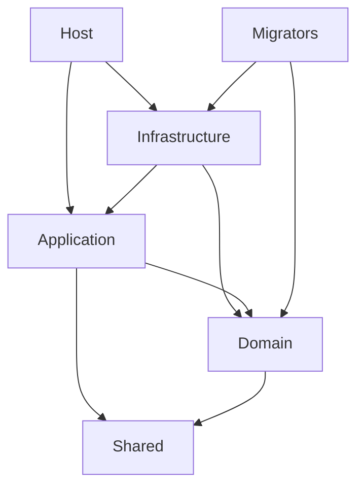

# ECO.WebApi Setup Guide

## Mục lục

1. [Giới thiệu và Kiến trúc Tổng quan](#1-giới-thiệu-và-kiến-trúc-tổng-quan)
2. [Setup Solution và Build Configuration](#2-setup-solution-và-build-configuration)
3. [Setup các Layers](#3-setup-các-layers)
4. [Identity Configuration](#4-identity-configuration)
5. [Database Configuration](#5-database-configuration)
6. [Application Services](#6-application-services)
7. [Infrastructure Services](#7-infrastructure-services)
8. [Testing và Verification](#8-testing-và-verification)
9. [Appendix](#9-appendix)

---

## 1. Giới thiệu và Kiến trúc Tổng quan

### 1.1. Clean Architecture Overview

ECO.WebApi được xây dựng theo mô hình **Clean Architecture** (Onion Architecture), tách biệt các concerns và đảm bảo dependency flow từ ngoài vào trong:

```
┌─────────────────────────────────────────────────────────┐
│                    Host Layer                           │
│  (ASP.NET Core Controllers, Program.cs)                │
└────────────────────┬──────────────────────────────────┘
                     │
┌────────────────────▼──────────────────────────────────┐
│              Infrastructure Layer                       │
│  (EF Core, Identity, Caching, Mailing, etc.)          │
└────────────────────┬──────────────────────────────────┘
                     │
┌────────────────────▼──────────────────────────────────┐
│              Application Layer                         │
│  (MediatR, FluentValidation, Mapster, DTOs)           │
└────────────────────┬──────────────────────────────────┘
                     │
┌────────────────────▼──────────────────────────────────┐
│                Domain Layer                            │
│  (Entities, Value Objects, Domain Events)              │
└────────────────────┬──────────────────────────────────┘
                     │
┌────────────────────▼──────────────────────────────────┐
│                Shared Layer                            │
│  (Common Contracts, Events, Notifications)             │
└────────────────────────────────────────────────────────┘
```

### 1.2. Dependency Flow



**Nguyên tắc:**
- **Host** phụ thuộc vào Infrastructure và Application
- **Infrastructure** phụ thuộc vào Application và Domain
- **Application** phụ thuộc vào Domain và Shared
- **Domain** chỉ phụ thuộc vào Shared (không phụ thuộc vào bất kỳ layer nào khác)
- **Shared** không phụ thuộc vào layer nào

### 1.3. Project Structure

```
ECO.WebApi/
├── Directory.Build.props          # Shared build properties
├── Directory.Build.targets        # Shared build targets
├── stylecop.json                  # Code style rules
├── .editorconfig                  # Editor configuration
├── ECO.WebApi.sln                 # Solution file
│
├── src/
│   ├── Core/
│   │   ├── Shared/                # Shared contracts and interfaces
│   │   ├── Domain/                # Domain entities and business logic
│   │   └── Application/           # Application services, DTOs, MediatR handlers
│   │
│   ├── Infrastructure/            # Infrastructure implementations
│   │   └── Infrastructure/
│   │       ├── Auth/              # Authentication & Authorization
│   │       ├── Persistence/       # EF Core, DbContext, Repositories
│   │       ├── Caching/           # Redis caching
│   │       ├── Mailing/           # Email services
│   │       ├── Notifications/     # SignalR notifications
│   │       └── ...
│   │
│   ├── Host/                      # ASP.NET Core Web API
│   │   └── Host/
│   │       ├── Controllers/       # API Controllers
│   │       ├── Configurations/    # Configuration JSON files
│   │       └── Program.cs         # Application entry point
│   │
│   └── Migrators/                 # Database migrations
│       └── Migrators.MSSQL/
│           └── Migrations/
│
└── README.md
```

---

## 2. Setup Solution và Build Configuration

### 2.1. Directory.Build.props

File [`Directory.Build.props`](Directory.Build.props) chứa các cấu hình build chung cho toàn bộ solution:

```xml
<Project>
	<PropertyGroup>
		<AnalysisLevel>latest</AnalysisLevel>
		<AnalysisMode>All</AnalysisMode>
		<TreatWarningsAsErrors>false</TreatWarningsAsErrors>
		<CodeAnalysisTreatWarningsAsErrors>false</CodeAnalysisTreatWarningsAsErrors>
		<EnforceCodeStyleInBuild>true</EnforceCodeStyleInBuild>
	</PropertyGroup>
	<ItemGroup>
		<PackageReference
			Include="StyleCop.Analyzers"
			Version="1.1.118"
			PrivateAssets="all"
			Condition="$(MSBuildProjectExtension) == '.csproj'"
		/>
		<PackageReference
			Include="SonarAnalyzer.CSharp"
			Version="9.7.0.75501"
			PrivateAssets="all"
			Condition="$(MSBuildProjectExtension) == '.csproj'"
		/>
	</ItemGroup>
</Project>
```

**Mục đích:**
- Áp dụng StyleCop và SonarAnalyzer cho tất cả projects
- Đảm bảo code quality và consistency
- Tự động áp dụng cho mọi `.csproj` file

### 2.2. Directory.Build.targets

File [`Directory.Build.targets`](Directory.Build.targets) định nghĩa build targets chung:

```xml
<Project>
    <PropertyGroup>
        <DocumentationFile>$(OutputPath)$(AssemblyName).xml</DocumentationFile>
    </PropertyGroup>
</Project>
```

**Mục đích:**
- Tự động generate XML documentation cho tất cả projects
- Hỗ trợ IntelliSense và API documentation

### 2.3. stylecop.json

File [`stylecop.json`](stylecop.json) chứa các quy tắc code style:

```json
{
  "$schema": "https://raw.githubusercontent.com/DotNetAnalyzers/StyleCopAnalyzers/master/StyleCop.Analyzers/StyleCop.Analyzers/Settings/stylecop.schema.json",
  "settings": {
    "orderingRules": {
      "systemUsingDirectivesFirst": true,
      "usingDirectivesPlacement": "outsideNamespace"
    },
    "layoutRules": {
      "newlineAtEndOfFile": "omit"
    }
  }
}
```

**Quy tắc:**
- System using directives phải đứng trước
- Using directives đặt bên ngoài namespace
- Không bắt buộc newline ở cuối file

### 2.4. .editorconfig

File `.editorconfig` (nếu có) chứa cấu hình editor. Đảm bảo file này tồn tại trong root directory để các IDE tự động áp dụng formatting rules.

---

## 3. Setup các Layers

### 3.1. Shared Layer

**Location:** [`src/Core/Shared/Shared.csproj`](src/Core/Shared/Shared.csproj)

**Mục đích:**
- Chứa các contracts và interfaces chung
- Không phụ thuộc vào bất kỳ layer nào
- Được sử dụng bởi tất cả các layers khác

**Cấu trúc:**
```xml
<Project Sdk="Microsoft.NET.Sdk">
	<PropertyGroup>
		<TargetFramework>net8.0</TargetFramework>
		<ImplicitUsings>enable</ImplicitUsings>
		<Nullable>enable</Nullable>
		<RootNamespace>ECO.WebApi.Shared</RootNamespace>
		<AssemblyName>ECO.WebApi.Shared</AssemblyName>
	</PropertyGroup>
</Project>
```

**Không có package dependencies** - đây là layer cơ bản nhất.

### 3.2. Domain Layer

**Location:** [`src/Core/Domain/Domain.csproj`](src/Core/Domain/Domain.csproj)

**Mục đích:**
- Chứa domain entities, value objects, domain events
- Business logic thuần túy, không phụ thuộc vào infrastructure

**Dependencies:**
```xml
<ItemGroup>
	<ProjectReference Include="..\Shared\Shared.csproj" />
</ItemGroup>
<ItemGroup>
	<PackageReference Include="NewId" Version="4.0.1" />
	<PackageReference Include="Microsoft.AspNetCore.Identity" Version="2.1.39" />
	<PackageReference Include="Microsoft.AspNetCore.Identity.EntityFrameworkCore" Version="8.0.0" />
</ItemGroup>
```

**Key Entities:**
- `ApplicationUser`, `ApplicationRole` , `ApplicationRole`, ApplicationRoleClaim, Permission - Identity entities
- `Product`, `Category` - Catalog entities
- `Order`, `OrderItem` - Ordering entities
- `Payment`, `Transaction` - Payment entities

### 3.3. Application Layer

**Location:** [`src/Core/Application/Application.csproj`](src/Core/Application/Application.csproj)

**Mục đích:**
- Chứa application services, DTOs, request/response models
- MediatR handlers, FluentValidation validators
- Mapster mapping configurations

**Dependencies:**
```xml
<ItemGroup>
	<ProjectReference Include="..\Domain\Domain.csproj" />
	<ProjectReference Include="..\Shared\Shared.csproj" />
</ItemGroup>
<ItemGroup>
	<PackageReference Include="Ardalis.Specification" Version="8.0.0" />
	<PackageReference Include="FluentValidation.DependencyInjectionExtensions" Version="11.9.2" />
	<PackageReference Include="Mapster" Version="7.4.0" />
	<PackageReference Include="MediatR" Version="12.4.0" />
	<PackageReference Include="Microsoft.Extensions.Caching.Abstractions" Version="8.0.0" />
	<PackageReference Include="Microsoft.Extensions.Localization" Version="8.0.0" />
	<PackageReference Include="Google.Apis.Drive.v3" Version="1.68.0.3574" />
</ItemGroup>
```

**Key Packages:**
- **MediatR** (v12.4.0): CQRS pattern implementation
- **FluentValidation** (v11.9.2): Request validation
- **Mapster** (v7.4.0): Object mapping (không phải AutoMapper)
- **Ardalis.Specification** (v8.0.0): Specification pattern cho queries

**Startup Configuration:**
File [`src/Core/Application/Startup.cs`](src/Core/Application/Startup.cs):

```csharp
using System.Reflection;
using FluentValidation;
using Microsoft.Extensions.DependencyInjection;

namespace ECO.WebApi.Application;
public static class Startup
{
    public static IServiceCollection AddApplication(this IServiceCollection services)
    {
        var assembly = Assembly.GetExecutingAssembly();
        return services
            .AddValidatorsFromAssembly(assembly)
            .AddMediatR(cfg => cfg.RegisterServicesFromAssembly(assembly));
    }
}
```

**Cách hoạt động:**
1. Tự động đăng ký tất cả FluentValidation validators từ assembly
2. Tự động đăng ký tất cả MediatR handlers (IRequestHandler, INotificationHandler) từ assembly

### 3.4. Infrastructure Layer

**Location:** [`src/Infrastructure/Infrastructure/Infrastructure.csproj`](src/Infrastructure/Infrastructure/Infrastructure.csproj)

**Mục đích:**
- Implementations của các interfaces từ Application và Domain
- EF Core, Identity, Caching, Mailing, Notifications, etc.

**Dependencies:**
```xml
<ItemGroup>
	<ProjectReference Include="..\..\Core\Application\Application.csproj" />
	<ProjectReference Include="..\..\Core\Domain\Domain.csproj" />
</ItemGroup>
```

**Key Packages:**
- **Entity Framework Core** (v8.0.0): ORM
- **Microsoft.EntityFrameworkCore.SqlServer** (v8.0.0): SQL Server provider
- **Ardalis.Specification.EntityFrameworkCore** (v8.0.0): EF Core integration cho Specification pattern
- **Hangfire** (v1.7.34): Background job processing
- **Serilog** packages: Structured logging
- **Microsoft.AspNetCore.SignalR** (v1.0.4): Real-time notifications
- **MailKit** (v3.6.0), **MimeKit** (v4.7.1): Email services
- **Azure.Storage.Blobs** (v12.21.2): Blob storage
- **Microsoft.Extensions.Caching.StackExchangeRedis** (v8.0.0): Redis caching

**Startup Configuration:**
File [`src/Infrastructure/Infrastructure/Startup.cs`](src/Infrastructure/Infrastructure/Startup.cs):

```csharp
public static IServiceCollection AddInfrastructure(this IServiceCollection services, IConfiguration config)
{
    MapsterSettings.Configure();
    return services
        .AddAuth(config)
        .AddGoogleDrive(config)
        .AddBackgroundJobs(config)
        .AddCaching(config)
        .AddCorsPolicy()
        .AddExceptionMiddleware()
        .AddBehaviours()
        .AddMailing(config)
        .AddNotifications(config)
        .AddPersistence()
        .AddRouting(options => options.LowercaseUrls = true)
        .AddServices(); 
}
```

**Modular Startup Pattern:**
Mỗi module có extension method riêng để đăng ký services:
- `AddAuth()` - Authentication & Authorization
- `AddPersistence()` - Database & Repositories
- `AddCaching()` - Redis caching
- `AddMailing()` - Email services
- `AddNotifications()` - SignalR notifications
- `AddBackgroundJobs()` - Hangfire jobs

### 3.5. Host Layer

**Location:** [`src/Host/Host/Host.csproj`](src/Host/Host/Host.csproj)

**Mục đích:**
- ASP.NET Core Web API entry point
- Controllers, API endpoints
- Configuration files

**Dependencies:**
```xml
<ItemGroup>
	<ProjectReference Include="..\..\Core\Application\Application.csproj" />
	<ProjectReference Include="..\..\Infrastructure\Infrastructure\Infrastructure.csproj" />
	<ProjectReference Include="..\..\Migrators\Migrators.MSSQL\Migrators.MSSQL.csproj" />
</ItemGroup>
<ItemGroup>
	<PackageReference Include="NSwag.Annotations" Version="14.1.0" />
	<PackageReference Include="Swashbuckle.AspNetCore" Version="6.4.0" />
	<PackageReference Include="FluentValidation.AspNetCore" Version="11.3.0" />
	<PackageReference Include="Hangfire.Console.Extensions.Serilog" Version="1.0.2" />
	<PackageReference Include="Microsoft.EntityFrameworkCore.Design" Version="8.0.0" />
	<PackageReference Include="Serilog.AspNetCore" Version="6.1.0" />
</ItemGroup>
```

**Program.cs:**
File [`src/Host/Host/Program.cs`](src/Host/Host/Program.cs):

```csharp
var builder = WebApplication.CreateBuilder(args);

// Configuration
builder.AddConfigurations().RegisterSerilog();
builder.Services.AddControllers();
builder.Services.AddInfrastructure(builder.Configuration);
builder.Services.AddApplication();

// Swagger
builder.Services.AddSwaggerGen(option => { /* ... */ });

var app = builder.Build();

// Database initialization
await app.Services.InitializeDatabasesAsync();

// Middleware pipeline
app.UseInfrastructure(builder.Configuration);
app.MapEndpoints();
app.Run();
```

**Configuration Files:**
Tất cả configuration files nằm trong [`src/Host/Host/Configurations/`](src/Host/Host/Configurations/):
- `database.json` - Database connection settings
- `logger.json` - Serilog configuration
- `security.json` - JWT & OAuth settings
- `cache.json` - Redis cache settings
- `mail.json` - SMTP settings
- `hangfire.json` - Hangfire settings
- `blob.json` - Azure Blob Storage settings
- `drive.json` - Google Drive settings
- `vnpay.json` - VNPay payment settings
- `signalr.json` - SignalR settings

**Configuration Loading:**
File [`src/Host/Host/Configurations/Startup.cs`](src/Host/Host/Configurations/Startup.cs) tự động load các file config theo environment:
- Base config: `Configurations/{name}.json`
- Environment-specific: `Configurations/{name}.{Environment}.json`

### 3.6. Migrators

**Location:** [`src/Migrators/Migrators.MSSQL/Migrators.MSSQL.csproj`](src/Migrators/Migrators.MSSQL/Migrators.MSSQL.csproj)

**Mục đích:**
- Chứa EF Core migrations
- Tách biệt migrations khỏi main application

**Migration Commands:**

Từ thư mục `src/Host/Host/`:

```bash
# Add migration
dotnet ef migrations add Initial --project ../../Migrators/Migrators.MSSQL/ --context ApplicationDbContext -o Migrations/Application

# Update database
dotnet ef database update --project ../../Migrators/Migrators.MSSQL/ --context ApplicationDbContext

# Remove last migration
dotnet ef migrations remove --project ../../Migrators/Migrators.MSSQL/ --context ApplicationDbContext

# List migrations
dotnet ef migrations list --project ../../Migrators/Migrators.MSSQL/ --context ApplicationDbContext
```

**Lưu ý:**
- Migration project phải reference Infrastructure và Domain projects
- Context được định nghĩa trong Infrastructure layer: `ApplicationDbContext`

---

## 4. Identity Configuration

### 4.1. Identity Entities

**Location:** [`src/Core/Domain/Identity/`](src/Core/Domain/Identity/)

**Key Entities:**
- `ApplicationUser` - Extends IdentityUser
- `ApplicationRole` - Extends IdentityRole
- `ApplicationRoleClaim` - Custom role claims
- `Permission`, `Function`, `Action` - Permission system
- `ActionInFunction` - Many-to-many relationship

### 4.2. EF Core Configurations

**Location:** [`src/Infrastructure/Infrastructure/Persistence/Configuration/Identity.cs`](src/Infrastructure/Infrastructure/Persistence/Configuration/Identity.cs)

**Configurations:**
- `ApplicationUserConfig` - Maps to `Identity.Users` table
- `ApplicationRoleConfig` - Maps to `Identity.Roles` table
- `ApplicationRoleClaimConfig` - Maps to `Identity.RoleClaims` table
- `IdentityUserRoleConfig` - Maps to `Identity.UserRoles` table
- `IdentityUserClaimConfig` - Maps to `Identity.UserClaims` table
- `IdentityUserLoginConfig` - Maps to `Identity.UserLogins` table
- `IdentityUserTokenConfig` - Maps to `Identity.UserTokens` table

**Schema:** Tất cả Identity tables sử dụng schema `Identity`.

### 4.3. Identity Services Setup

**Location:** [`src/Infrastructure/Infrastructure/Identity/Startup.cs`](src/Infrastructure/Infrastructure/Identity/Startup.cs)

```csharp
internal static IServiceCollection AddIdentity(this IServiceCollection services) =>
    services
        .AddIdentity<ApplicationUser, ApplicationRole>(options =>
        {
            options.Password.RequiredLength = 6;
            options.Password.RequireDigit = false;
            options.Password.RequireLowercase = false;
            options.Password.RequireNonAlphanumeric = false;
            options.Password.RequireUppercase = false;
            options.User.RequireUniqueEmail = true;
        })
        .AddEntityFrameworkStores<ApplicationDbContext>()
        .AddDefaultTokenProviders()
        .Services;
```

**Password Policy:**
- Minimum length: 6 characters
- Không yêu cầu: digit, lowercase, uppercase, non-alphanumeric
- Email phải unique

**Token Providers:**
- Default token providers được đăng ký (email confirmation, password reset, etc.)

### 4.4. Authentication Setup

**Location:** [`src/Infrastructure/Infrastructure/Auth/Startup.cs`](src/Infrastructure/Infrastructure/Auth/Startup.cs)

**Flow:**
1. `AddCurrentUser()` - Current user service
2. `AddPermissions()` - Permission-based authorization
3. `AddIdentity()` - Identity services (phải đăng ký trước auth)
4. `AddO2Authentication()` - OAuth2 (Google, Facebook)
5. `AddJwtAuth()` - JWT Bearer authentication

**Permission System:**
- `PermissionPolicyProvider` - Dynamic policy provider
- `PermissionAuthorizationHandler` - Authorization handler
- Policies được tạo động dựa trên permissions trong database

---

## 5. Database Configuration

### 5.1. DatabaseSettings

**Location:** [`src/Infrastructure/Infrastructure/Persistence/`](src/Infrastructure/Infrastructure/Persistence/)

**Configuration File:** [`src/Host/Host/Configurations/database.json`](src/Host/Host/Configurations/database.json)

```json
{
  "DatabaseSettings": {
    "DBProvider": "mssql",
    "ConnectionString": "Server=localhost;Database=ECO;Trusted_Connection=True;TrustServerCertificate=True;"
  }
}
```

**Supported Providers:**
- `mssql` - SQL Server (hiện tại chỉ hỗ trợ provider này)

### 5.2. DbContext Setup

**BaseDbContext:**
File [`src/Infrastructure/Infrastructure/Persistence/Context/BaseDbContext.cs`](src/Infrastructure/Infrastructure/Persistence/Context/BaseDbContext.cs)

**Features:**
- Extends `IdentityDbContext<ApplicationUser, ApplicationRole, ...>`
- Global query filters cho `ISoftDelete` entities
- Audit trails support
- Event publishing support

**ApplicationDbContext:**
File [`src/Infrastructure/Infrastructure/Persistence/Context/ApplicationDbContext.cs`](src/Infrastructure/Infrastructure/Persistence/Context/ApplicationDbContext.cs)

**DbSets:**
- Attributes: `Attributes`, `AttributeValues`
- Catalog: `Products`, `Categories`, `ProductCategories`, `Variants`, etc.
- Ordering: `Orders`, `OrderItems`
- Basket: `Carts`, `CartItems`
- Identity: `Permissions`, `Functions`, `Actions`, `ActionInFunctions`
- Payment: `Payments`, `Transactions`
- Notifications: `Notifications`

**Persistence Startup:**
File [`src/Infrastructure/Infrastructure/Persistence/Startup.cs`](src/Infrastructure/Infrastructure/Persistence/Startup.cs)

```csharp
internal static IServiceCollection AddPersistence(this IServiceCollection services)
{
    services.AddOptions<DatabaseSettings>()
        .BindConfiguration(nameof(DatabaseSettings))
        .ValidateDataAnnotations()
        .ValidateOnStart();

    return services
        .AddDbContext<ApplicationDbContext>((p, m) =>
        {
            var databaseSettings = p.GetRequiredService<IOptions<DatabaseSettings>>().Value;
            var validator = p.GetRequiredService<IConnectionStringValidator>();
            validator.TryValidate(databaseSettings.ConnectionString, databaseSettings.DBProvider);

            var securer = p.GetRequiredService<IConnectionStringSecurer>();
            var secureConnectionString = securer.MakeSecure(databaseSettings.ConnectionString, databaseSettings.DBProvider);
            m.UseDatabase(databaseSettings.DBProvider, secureConnectionString);
        })
        .AddTransient<IDatabaseInitializer, DatabaseInitializer>()
        .AddTransient<ApplicationDbInitializer>()
        .AddTransient<ApplicationDbSeeder>()
        .AddTransient<CustomSeederRunner>()
        .AddServices(typeof(ICustomSeeder), ServiceLifetime.Transient)
        .AddTransient<IConnectionStringSecurer, ConnectionStringSecurer>()
        .AddTransient<IConnectionStringValidator, ConnectionStringValidator>()
        .AddRepositories();
}
```

**Repository Pattern:**
- `IRepository<T>` - Generic repository
- `IReadRepository<T>` - Read-only repository
- `IRepositoryWithEvents<T>` - Repository với domain events
- Tự động đăng ký cho tất cả `IAggregateRoot` entities

### 5.3. Database Initialization

**Location:** [`src/Infrastructure/Infrastructure/Persistence/Initialization/`](src/Infrastructure/Infrastructure/Persistence/Initialization/)

**Initialization Flow:**
1. `IDatabaseInitializer` - Main initializer interface
2. `DatabaseInitializer` - Orchestrates initialization
3. `ApplicationDbInitializer` - Application-specific initialization
4. `ApplicationDbSeeder` - Seeds initial data
5. `CustomSeederRunner` - Runs custom seeders (implementing `ICustomSeeder`)

**Initialization trong Program.cs:**
```csharp
await app.Services.InitializeDatabasesAsync();
```

**Cách hoạt động:**
1. Tạo database nếu chưa tồn tại
2. Apply migrations
3. Seed initial data (roles, permissions, admin user, etc.)
4. Run custom seeders

### 5.4. Migration Commands

**Từ thư mục `src/Host/Host/`:**

```bash
# Add new migration
dotnet ef migrations add MigrationName --project ../../Migrators/Migrators.MSSQL/ --context ApplicationDbContext -o Migrations/Application

# Update database to latest migration
dotnet ef database update --project ../../Migrators/Migrators.MSSQL/ --context ApplicationDbContext

# Update to specific migration
dotnet ef database update MigrationName --project ../../Migrators/Migrators.MSSQL/ --context ApplicationDbContext

# Remove last migration (chưa apply)
dotnet ef migrations remove --project ../../Migrators/Migrators.MSSQL/ --context ApplicationDbContext

# List all migrations
dotnet ef migrations list --project ../../Migrators/Migrators.MSSQL/ --context ApplicationDbContext

# Generate SQL script (không apply)
dotnet ef migrations script --project ../../Migrators/Migrators.MSSQL/ --context ApplicationDbContext

# Generate SQL script từ migration cụ thể
dotnet ef migrations script FromMigration ToMigration --project ../../Migrators/Migrators.MSSQL/ --context ApplicationDbContext --output migration.sql
```

**Lưu ý:**
- Phải có `Microsoft.EntityFrameworkCore.Design` package trong Host project
- Migration project phải reference Infrastructure và Domain
- Context name: `ApplicationDbContext`

---

## 6. Application Services

### 6.1. MediatR Configuration

**Package:** MediatR v12.4.0

**Location:** [`src/Core/Application/Startup.cs`](src/Core/Application/Startup.cs)

```csharp
.AddMediatR(cfg => cfg.RegisterServicesFromAssembly(assembly));
```

**Cách sử dụng:**
- Tạo request class implement `IRequest<TResponse>` hoặc `IRequest`
- Tạo handler class implement `IRequestHandler<TRequest, TResponse>`
- Tạo notification class implement `INotification`
- Tạo notification handler class implement `INotificationHandler<TNotification>`

**Example:**
```csharp
// Request
public record GetProductRequest(Guid Id) : IRequest<ProductDto>;

// Handler
public class GetProductHandler : IRequestHandler<GetProductRequest, ProductDto>
{
    public async Task<ProductDto> Handle(GetProductRequest request, CancellationToken cancellationToken)
    {
        // Implementation
    }
}

// Usage in Controller
[HttpGet("{id}")]
public async Task<ProductDto> GetProduct(Guid id)
{
    return await _mediator.Send(new GetProductRequest(id));
}
```

### 6.2. FluentValidation Setup

**Package:** FluentValidation.DependencyInjectionExtensions v11.9.2

**Location:** [`src/Core/Application/Startup.cs`](src/Core/Application/Startup.cs)

```csharp
.AddValidatorsFromAssembly(assembly);
```

**Cách sử dụng:**
- Tạo validator class kế thừa `AbstractValidator<TRequest>`
- Validator tự động được đăng ký và chạy trước khi handler được gọi

**Example:**
```csharp
public class GetProductRequestValidator : AbstractValidator<GetProductRequest>
{
    public GetProductRequestValidator()
    {
        RuleFor(x => x.Id)
            .NotEmpty()
            .WithMessage("Product ID is required");
    }
}
```

### 6.3. Mapster Configuration

**Package:** Mapster v7.4.0

**Lưu ý:** Project sử dụng **Mapster**, không phải AutoMapper.

**Location:** [`src/Infrastructure/Infrastructure/Mapping/MapsterSettings.cs`](src/Infrastructure/Infrastructure/Mapping/MapsterSettings.cs)

**Configuration:**
```csharp
public class MapsterSettings
{
    public static void Configure()
    {
        // Custom mappings
        TypeAdapterConfig<Product, ProductDto>.NewConfig()
            .Map(dest => dest.Categories, src => src.ProductCategories.Select(x => x.Category.Adapt<CategoryInProductDto>()).ToList())
            .Map(dest => dest.Attributes, src => src.Attributes.Adapt<List<AttributeDto>>())
            .Map(dest => dest.Variants, src => src.Variants.Adapt<List<VariantDto>>());
        
        // More mappings...
    }
}
```

**Được gọi trong:** [`src/Infrastructure/Infrastructure/Startup.cs`](src/Infrastructure/Infrastructure/Startup.cs)

```csharp
MapsterSettings.Configure();
```

**Cách sử dụng:**
```csharp
// Simple mapping
var dto = entity.Adapt<ProductDto>();

// Mapping với custom config
var dto = entity.Adapt<ProductDto>(TypeAdapterConfig.GlobalSettings);
```

---

## 7. Infrastructure Services

### 7.1. Modular Startup Pattern

Infrastructure layer sử dụng **modular startup pattern** - mỗi module có extension method riêng để đăng ký services.

**Main Startup:**
File [`src/Infrastructure/Infrastructure/Startup.cs`](src/Infrastructure/Infrastructure/Startup.cs)

```csharp
public static IServiceCollection AddInfrastructure(this IServiceCollection services, IConfiguration config)
{
    MapsterSettings.Configure();
    return services
        .AddAuth(config)              // Authentication & Authorization
        .AddGoogleDrive(config)       // Google Drive integration
        .AddBackgroundJobs(config)     // Hangfire
        .AddCaching(config)            // Redis caching
        .AddCorsPolicy()               // CORS
        .AddExceptionMiddleware()      // Global exception handling
        .AddBehaviours()               // MediatR behaviors
        .AddMailing(config)            // Email services
        .AddNotifications(config)      // SignalR notifications
        .AddPersistence()              // Database & Repositories
        .AddRouting(options => options.LowercaseUrls = true)
        .AddServices();                // Application services
}
```

### 7.2. Service Registration

**Module Locations:**
- Auth: [`src/Infrastructure/Infrastructure/Auth/Startup.cs`](src/Infrastructure/Infrastructure/Auth/Startup.cs)
- Persistence: [`src/Infrastructure/Infrastructure/Persistence/Startup.cs`](src/Infrastructure/Infrastructure/Persistence/Startup.cs)
- Caching: [`src/Infrastructure/Infrastructure/Caching/Startup.cs`](src/Infrastructure/Infrastructure/Caching/Startup.cs)
- Mailing: [`src/Infrastructure/Infrastructure/Mailing/Startup.cs`](src/Infrastructure/Infrastructure/Mailing/Startup.cs)
- Notifications: [`src/Infrastructure/Infrastructure/Notifications/Startup.cs`](src/Infrastructure/Infrastructure/Notifications/Startup.cs)
- BackgroundJobs: [`src/Infrastructure/Infrastructure/BackgroundJobs/Startup.cs`](src/Infrastructure/Infrastructure/BackgroundJobs/Startup.cs)

### 7.3. Middleware Pipeline

**Location:** [`src/Infrastructure/Infrastructure/Startup.cs`](src/Infrastructure/Infrastructure/Startup.cs)

```csharp
public static IApplicationBuilder UseInfrastructure(this IApplicationBuilder builder, IConfiguration config) =>
    builder
        .UseFileStorage()
        .UseExceptionMiddleware()
        .UseRouting()
        .UseCorsPolicy()
        .UseHttpsRedirection()
        .UseAuthentication()
        .UseCurrentUser()
        .UseAuthorization()
        .UseHangfireDashboard(config);
```

**Middleware Order:**
1. File Storage - Static file serving
2. Exception Middleware - Global exception handling
3. Routing - Endpoint routing
4. CORS - Cross-origin resource sharing
5. HTTPS Redirection - Force HTTPS
6. Authentication - JWT/OAuth authentication
7. Current User - Set current user context
8. Authorization - Permission-based authorization
9. Hangfire Dashboard - Background jobs dashboard

**Endpoint Mapping:**
```csharp
public static IEndpointRouteBuilder MapEndpoints(this IEndpointRouteBuilder builder)
{
    builder.MapControllers()
        .RequireAuthorization();
    return builder;
}
```

Tất cả controllers yêu cầu authorization mặc định.

---

## 8. Testing và Verification

### 8.1. Verify Setup Steps

**1. Build Solution:**
```bash
dotnet build ECO.WebApi.sln
```

**2. Verify NuGet Packages:**
```bash
dotnet restore ECO.WebApi.sln
```

**3. Check Database Connection:**
- Kiểm tra `Configurations/database.json`
- Đảm bảo connection string đúng
- Database phải tồn tại hoặc có quyền tạo mới

**4. Run Application:**
```bash
cd src/Host/Host
dotnet run
```

**5. Verify Endpoints:**
- Swagger UI: `https://localhost:5001/swagger` (hoặc port được config)
- Health check endpoints (nếu có)
- Authentication endpoints

**6. Verify Database:**
- Kiểm tra migrations đã được apply
- Kiểm tra seed data đã được tạo
- Kiểm tra Identity tables

### 8.2. Common Issues

**Issue 1: Migration không tìm thấy Context**
```
Error: Unable to create an object of type 'ApplicationDbContext'.
```

**Solution:**
- Đảm bảo `Microsoft.EntityFrameworkCore.Design` được thêm vào Host project
- Kiểm tra context name: `ApplicationDbContext`
- Đảm bảo migration project reference đúng Infrastructure và Domain

**Issue 2: Connection String không hợp lệ**
```
Error: The connection string is invalid.
```

**Solution:**
- Kiểm tra `Configurations/database.json`
- Đảm bảo format connection string đúng
- Kiểm tra SQL Server đang chạy
- Kiểm tra firewall và network access

**Issue 3: Mapster không hoạt động**
```
Error: TypeAdapterConfig not found
```

**Solution:**
- Đảm bảo `MapsterSettings.Configure()` được gọi trong `Infrastructure.Startup.AddInfrastructure()`
- Kiểm tra Mapster package version: v7.4.0

**Issue 4: MediatR handlers không được đăng ký**
```
Error: No handler registered for request type
```

**Solution:**
- Đảm bảo handler implement đúng interface: `IRequestHandler<TRequest, TResponse>`
- Đảm bảo `AddApplication()` được gọi trong `Program.cs`
- Kiểm tra assembly scanning

**Issue 5: FluentValidation không chạy**
```
Error: Validation not executed
```

**Solution:**
- Đảm bảo validator kế thừa `AbstractValidator<TRequest>`
- Đảm bảo `AddValidatorsFromAssembly()` được gọi
- Kiểm tra validator namespace và assembly

**Issue 6: Identity không hoạt động**
```
Error: UserManager not registered
```

**Solution:**
- Đảm bảo `AddIdentity()` được gọi trước `AddJwtAuth()`
- Kiểm tra `AddPersistence()` đã được gọi
- Kiểm tra `ApplicationDbContext` extends `BaseDbContext` đúng cách

---

## 9. Appendix

### 9.1. NuGet Packages Reference

#### Core Packages

**Domain Layer:**
- `NewId` v4.0.1 - Unique ID generation
- `Microsoft.AspNetCore.Identity` v2.1.39 - Identity core
- `Microsoft.AspNetCore.Identity.EntityFrameworkCore` v8.0.0 - EF Core Identity integration

**Application Layer:**
- `Ardalis.Specification` v8.0.0 - Specification pattern
- `FluentValidation.DependencyInjectionExtensions` v11.9.2 - FluentValidation DI
- `Mapster` v7.4.0 - Object mapping
- `MediatR` v12.4.0 - CQRS/Mediator pattern
- `Microsoft.Extensions.Caching.Abstractions` v8.0.0 - Caching abstractions
- `Microsoft.Extensions.Localization` v8.0.0 - Localization
- `Google.Apis.Drive.v3` v1.68.0.3574 - Google Drive API

**Infrastructure Layer:**
- `Ardalis.Specification.EntityFrameworkCore` v8.0.0 - EF Core Specification
- `Microsoft.EntityFrameworkCore` v8.0.0 - EF Core
- `Microsoft.EntityFrameworkCore.SqlServer` v8.0.0 - SQL Server provider
- `Microsoft.EntityFrameworkCore.Tools` v8.0.0 - EF Core tools
- `Hangfire` v1.7.34 - Background jobs
- `Serilog.*` packages - Structured logging
- `Microsoft.AspNetCore.SignalR` v1.0.4 - Real-time communication
- `MailKit` v3.6.0, `MimeKit` v4.7.1 - Email
- `Azure.Storage.Blobs` v12.21.2 - Blob storage
- `Microsoft.Extensions.Caching.StackExchangeRedis` v8.0.0 - Redis caching

**Host Layer:**
- `Swashbuckle.AspNetCore` v6.4.0 - Swagger/OpenAPI
- `FluentValidation.AspNetCore` v11.3.0 - FluentValidation ASP.NET Core
- `Serilog.AspNetCore` v6.1.0 - Serilog ASP.NET Core
- `Microsoft.EntityFrameworkCore.Design` v8.0.0 - EF Core design-time tools

**Build Tools:**
- `StyleCop.Analyzers` v1.1.118 - Code style analysis
- `SonarAnalyzer.CSharp` v9.7.0.75501 - Code quality analysis

### 9.2. File Structure

```
ECO.WebApi/
├── Directory.Build.props
├── Directory.Build.targets
├── stylecop.json
├── .editorconfig
├── ECO.WebApi.sln
├── SETUP_GUIDE.md
│
├── src/
│   ├── Core/
│   │   ├── Shared/
│   │   │   ├── Authorization/
│   │   │   ├── Events/
│   │   │   └── Notifications/
│   │   │
│   │   ├── Domain/
│   │   │   ├── Attributes/
│   │   │   ├── Basket/
│   │   │   ├── Catalog/
│   │   │   ├── Common/
│   │   │   ├── Enum/
│   │   │   ├── Identity/
│   │   │   ├── Notifications/
│   │   │   ├── Ordering/
│   │   │   └── Payment/
│   │   │
│   │   └── Application/
│   │       ├── Auditing/
│   │       ├── Catalog/
│   │       ├── Common/
│   │       ├── GoogleDrive/
│   │       ├── Identity/
│   │       ├── Notifications/
│   │       └── Payment/
│   │
│   ├── Infrastructure/
│   │   └── Infrastructure/
│   │       ├── Auth/
│   │       ├── Auditing/
│   │       ├── BackgroundJobs/
│   │       ├── Behaviors/
│   │       ├── BlobStorage/
│   │       ├── Caching/
│   │       ├── Common/
│   │       ├── Cors/
│   │       ├── FileStorage/
│   │       ├── GoogleDrive/
│   │       ├── Identity/
│   │       ├── Logging/
│   │       ├── Mailing/
│   │       ├── Mapping/
│   │       ├── Middleware/
│   │       ├── Notifications/
│   │       ├── Persistence/
│   │       └── VNPAY/
│   │
│   ├── Host/
│   │   └── Host/
│   │       ├── Controllers/
│   │       ├── Configurations/
│   │       ├── Email Templates/
│   │       └── Program.cs
│   │
│   └── Migrators/
│       └── Migrators.MSSQL/
│           └── Migrations/
│
└── README.md
```

### 9.3. Key Design Decisions

**1. Tại sao dùng Clean Architecture?**
- Separation of concerns: Business logic tách biệt khỏi infrastructure
- Testability: Dễ test domain logic mà không cần database
- Maintainability: Dễ maintain và extend
- Flexibility: Dễ thay đổi infrastructure (database, caching, etc.)

**2. Tại sao tách BaseDbContext?**
- Reusability: Có thể tạo multiple DbContexts (multi-tenant, read-only, etc.)
- Shared functionality: Audit trails, soft delete, events được share
- Flexibility: Mỗi DbContext có thể có thêm features riêng

**3. Tại sao dùng Mapster thay vì AutoMapper?**
- Performance: Mapster nhanh hơn AutoMapper
- Compile-time safety: Type-safe mapping
- Less configuration: Convention-based mapping
- Smaller footprint: Ít dependencies hơn

**4. Tại sao dùng MediatR?**
- CQRS pattern: Tách biệt commands và queries
- Decoupling: Controllers không phụ thuộc trực tiếp vào services
- Pipeline behaviors: Dễ thêm logging, validation, caching
- Testability: Dễ test handlers độc lập

**5. Tại sao tách Migrators project?**
- Separation: Migrations tách biệt khỏi application code
- Multiple databases: Dễ support multiple database providers
- Deployment: Có thể deploy migrations riêng
- Version control: Dễ quản lý migration history

### 9.4. Best Practices

**1. Domain Layer:**
- Chỉ chứa business logic, không có infrastructure dependencies
- Entities phải rich (có methods, không chỉ properties)
- Sử dụng domain events cho side effects
- Value objects cho các concepts phức tạp

**2. Application Layer:**
- DTOs chỉ chứa data, không có business logic
- Handlers nên thin, delegate cho domain services
- Sử dụng Specification pattern cho complex queries
- Validation logic trong FluentValidation validators

**3. Infrastructure Layer:**
- Implementations phải đơn giản, delegate cho domain
- Sử dụng repository pattern để abstract data access
- Caching ở infrastructure layer, không ở application layer
- Error handling và logging ở infrastructure

**4. Host Layer:**
- Controllers nên thin, chỉ route requests
- Configuration files tách biệt theo module
- Middleware pipeline rõ ràng và có thứ tự
- Swagger documentation đầy đủ

---

## Kết luận

Tài liệu này cung cấp hướng dẫn chi tiết để setup và hiểu rõ kiến trúc của ECO.WebApi project. Nếu có thắc mắc hoặc vấn đề, vui lòng tham khảo:

- Code comments trong source code
- Official documentation của các packages được sử dụng
- Common Issues section ở trên

**Lưu ý quan trọng:**
- Project sử dụng **Mapster** (v7.4.0), không phải AutoMapper
- Migration commands phải chạy từ thư mục `src/Host/Host/`
- Tất cả configuration files nằm trong `src/Host/Host/Configurations/`
- Database initialization tự động chạy khi application start

---

*Last updated: 2024*
