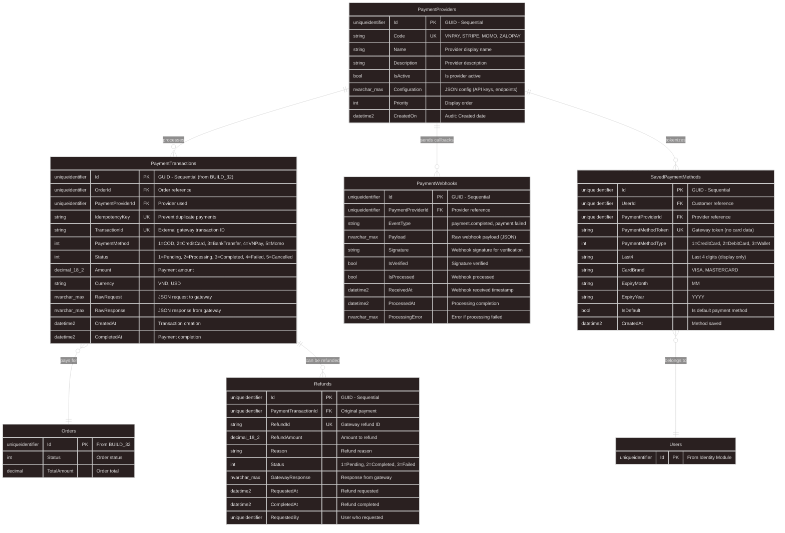

# BUILD_34: Database Design - Payment Gateway Integration (VNPay, Stripe)

> 📚 [Quay lại Mục lục](BUILD_INDEX.md)  
> 📋 **Prerequisites:** BUILD_32 (Order Module) đã complete  
> 🎯 **Approach:** Code-First với EF Core - Multi-Gateway Support  
> 💳 **Features:** VNPay, Stripe, Momo, ZaloPay Integration  
> ⚠️ **Important:** Secure Payment Processing with Idempotency  
> ⭐ **Design Philosophy:** **Provider-Agnostic Design** - Easy to add new gateways

Tài liệu này hướng dẫn **thiết kế database cho Payment Gateway Integration** với support cho nhiều payment providers.

---

## 1. Overview

**Làm gì:** Thiết kế và implement Payment Gateway Integration cho multiple providers (VNPay, Stripe, Momo, ZaloPay).

**Tại sao cần:**
- **Multi-Gateway Support:** VNPay (Vietnam), Stripe (International), Momo, ZaloPay
- **Secure Processing:** PCI-DSS compliant design (no sensitive data storage)
- **Idempotency:** Prevent duplicate payments
- **Webhook Handling:** Process payment callbacks từ gateways
- **Refund Management:** Track refunds và partial refunds
- **Audit Trail:** Complete payment history
- ⭐ **Provider-Agnostic:** Easy to add new gateways without schema changes

**Trong bước này chúng ta sẽ:**
- ✅ Extend PaymentTransaction entity (từ BUILD_32)
- ✅ Thiết kế PaymentProvider entity (gateway config)
- ✅ Thiết kế PaymentWebhook entity (callback tracking)
- ✅ Thiết kế Refund entity (refund management)
- ✅ Thiết kế PaymentMethod entity (saved cards, wallets)
- ✅ EF Core configurations & indexes
- ✅ Integration với Order module (BUILD_32)
- ✅ Security best practices

**Database Schema Summary:**
```
5 New Tables (+ extend PaymentTransaction from BUILD_32):
├── PaymentProviders (Gateway config: VNPay, Stripe, Momo, ZaloPay)
├── PaymentTransactions (Extended: Provider, IdempotencyKey, RawRequest/Response)
├── PaymentWebhooks (Callback tracking: Event, Payload, Verified, Processed)
├── Refunds (Refund tracking: Amount, Reason, Status, RefundId)
└── SavedPaymentMethods (Customer cards/wallets: Token, Last4, ExpiryDate)
```

**Payment Flow:**
```
1. Create Order (BUILD_32)
2. Create PaymentTransaction (Status: Pending, IdempotencyKey generated)
3. Redirect to Gateway (VNPay/Stripe checkout)
4. Customer pays on gateway
5. Gateway sends Webhook (callback)
6. Process Webhook → Update PaymentTransaction (Status: Completed)
7. Confirm Order (BUILD_32: Deduct inventory, send email)
```

**Why Provider-Agnostic Design?**
- ✅ **Flexibility:** Easy to switch gateways or add new ones
- ✅ **No Vendor Lock-in:** Not tied to specific gateway
- ✅ **Unified Interface:** Same code for all gateways
- ✅ **Multi-Gateway:** Support multiple gateways simultaneously
- ✅ **Research-based:** Stripe, Adyen, Braintree use this pattern

---

## 1.1. Entity Relationship Diagram (ERD)



**Key Relationships:**
- ✅ **PaymentProviders → PaymentTransactions**: 1-to-Many (Gateway processes payments)
- ✅ **PaymentProviders → PaymentWebhooks**: 1-to-Many (Gateway sends callbacks)
- ✅ **PaymentTransactions → Orders**: Many-to-1 (Multiple attempts per order)
- ✅ **PaymentTransactions → Refunds**: 1-to-Many (Partial refunds supported)
- ✅ **SavedPaymentMethods → Users**: Many-to-1 (Customer saved cards/wallets)

---

## 2. Payment Enums

### 2.1. PaymentStatus Enum (Extended from BUILD_32)

**File:** `src/Core/Domain/Enum/PaymentStatus.cs` (Updated)

```csharp
namespace ECO.WebApi.Domain.Enum;

/// <summary>
/// Payment transaction status
/// </summary>
public enum PaymentStatus
{
    /// <summary>
    /// Payment created, awaiting customer action
    /// </summary>
    Pending = 1,
    
/// <summary>
    /// Payment being processed by gateway
    /// </summary>
    Processing = 2,
    
    /// <summary>
    /// Payment successful
    /// </summary>
    Completed = 3,
    
    /// <summary>
    /// Payment failed
    /// </summary>
  Failed = 4,
  
    /// <summary>
    /// Payment cancelled by customer
    /// </summary>
    Cancelled = 5,
 
    /// <summary>
    /// Payment refunded (full or partial)
    /// </summary>
    Refunded = 6,
    
    /// <summary>
    /// Payment expired (customer didn't complete)
    /// </summary>
  Expired = 7
}
```

**Status Flow:**
```
Pending → Processing → Completed
   ↓    ↓            ↓
Cancelled  Failed Refunded
   ↓
Expired
```

---

### 2.2. RefundStatus Enum

**File:** `src/Core/Domain/Enum/RefundStatus.cs`

```csharp
namespace ECO.WebApi.Domain.Enum;

/// <summary>
/// Refund status
/// </summary>
public enum RefundStatus
{
    /// <summary>
    /// Refund requested, awaiting processing
    /// </summary>
    Pending = 1,
    
/// <summary>
    /// Refund completed successfully
    /// </summary>
    Completed = 2,
    
    /// <summary>
    /// Refund failed
    /// </summary>
    Failed = 3
}
```

---

### 2.3. PaymentMethodType Enum

**File:** `src/Core/Domain/Enum/PaymentMethodType.cs`

```csharp
namespace ECO.WebApi.Domain.Enum;

/// <summary>
/// Saved payment method types
/// </summary>
public enum PaymentMethodType
{
    /// <summary>
    /// Credit card
  /// </summary>
    CreditCard = 1,
  
    /// <summary>
    /// Debit card
/// </summary>
    DebitCard = 2,
    
    /// <summary>
    /// E-wallet (Momo, ZaloPay)
    /// </summary>
    Wallet = 3,
  
 /// <summary>
    /// Bank account
    /// </summary>
    BankAccount = 4
}
```

---

## 3. Core Entities

### 3.1. PaymentProvider Entity ⭐⭐

**File:** `src/Core/Domain/Payment/PaymentProvider.cs`

```csharp
namespace ECO.WebApi.Domain.Payment;

/// <summary>
/// Payment gateway provider (VNPay, Stripe, Momo, ZaloPay)
/// </summary>
public class PaymentProvider : AuditableEntity, IAggregateRoot
{
    // ==================== Basic Info ====================
    
    /// <summary>
    /// Provider code (VNPAY, STRIPE, MOMO, ZALOPAY)
    /// </summary>
    public string Code { get; private set; }
    
    public string Name { get; private set; }
    public string? Description { get; private set; }
    
    // ==================== Status ====================
    
    public bool IsActive { get; private set; }
    public int Priority { get; private set; }  // Display order
    
    // ==================== Configuration (Encrypted) ⭐ ====================
    
    /// <summary>
    /// JSON configuration (API keys, endpoints, secrets)
    /// MUST BE ENCRYPTED in production
    /// </summary>
    public string Configuration { get; private set; }
    
    // ==================== Navigation Properties ====================
    
    public virtual List<PaymentTransaction> PaymentTransactions { get; private set; } = new();
    public virtual List<PaymentWebhook> PaymentWebhooks { get; private set; } = new();
    
    // ==================== Constructors ====================
    
    private PaymentProvider() { }
    
    public PaymentProvider(
        string code,
        string name,
        string configuration,
        string? description = null,
        int priority = 0)
    {
     if (string.IsNullOrWhiteSpace(code))
   throw new ArgumentException("Code is required", nameof(code));

        Code = code.ToUpperInvariant();
      Name = name;
  Description = description;
 Configuration = configuration;
      IsActive = true;
        Priority = priority;
    }
    
    // ==================== Business Methods ====================
    
    public void Activate()
    {
      IsActive = true;
    }
    
    public void Deactivate()
    {
 IsActive = false;
}
    
    public void UpdateConfiguration(string configuration)
    {
        if (string.IsNullOrWhiteSpace(configuration))
            throw new ArgumentException("Configuration is required", nameof(configuration));
        
     Configuration = configuration;
    }
    
    public void UpdatePriority(int priority)
    {
    Priority = priority;
    }
}
```

**Key Points:**
- ✅ **Configuration Storage:** JSON format (encrypted in production)
- ✅ **Provider-Agnostic:** Code-based identification (VNPAY, STRIPE, etc.)
- ✅ **Priority Support:** Control display order in UI
- ✅ **Active/Inactive:** Enable/disable gateways dynamically

---

### 3.2. Extended PaymentTransaction Entity (from BUILD_32) ⭐⭐⭐

**File:** `src/Core/Domain/Payment/PaymentTransaction.cs` (Extended)

```csharp
using ECO.WebApi.Domain.Enum;

namespace ECO.WebApi.Domain.Payment;

/// <summary>
/// Payment transaction (Extended from BUILD_32)
/// </summary>
public class PaymentTransaction : BaseEntity
{
    // ==================== References ====================
    
    public Guid OrderId { get; private set; }
    public Guid? PaymentProviderId { get; private set; }  // NULL for COD
    
    // ==================== Idempotency (Prevent Duplicates) ⭐ ====================
    
    /// <summary>
    /// Idempotency key (prevent duplicate payments)
    /// Format: {OrderId}:{Timestamp}:{RandomGuid}
    /// </summary>
    public string IdempotencyKey { get; private set; }
    
// ==================== Gateway Info ====================
    
    /// <summary>
    /// External transaction ID from gateway
    /// </summary>
    public string? TransactionId { get; private set; }
    
    public PaymentMethod PaymentMethod { get; private set; }
    public PaymentStatus Status { get; private set; }
    public decimal Amount { get; private set; }
  public string Currency { get; private set; }  // VND, USD
    
    // ==================== Gateway Communication (For Debugging) ====================
    
    /// <summary>
    /// Raw request sent to gateway (JSON)
    /// </summary>
  public string? RawRequest { get; private set; }
    
    /// <summary>
    /// Raw response from gateway (JSON)
    /// </summary>
    public string? RawResponse { get; private set; }
    
    // ==================== Timestamps ====================
    
    public DateTime CreatedAt { get; private set; }
public DateTime? CompletedAt { get; private set; }
    public DateTime? ExpiresAt { get; private set; }  // Payment link expiration
    
    // ==================== Navigation Properties ====================
    
public virtual Order Order { get; private set; } = default!;
    public virtual PaymentProvider? PaymentProvider { get; private set; }
    public virtual List<Refund> Refunds { get; private set; } = new();
    
 // ==================== Constructors ====================
    
    private PaymentTransaction() { }
    
    public PaymentTransaction(
     Guid orderId,
   PaymentMethod paymentMethod,
        decimal amount,
        string currency,
        Guid? paymentProviderId = null,
  TimeSpan? expirationPeriod = null)
    {
        if (amount <= 0)
     throw new ArgumentException("Amount must be positive", nameof(amount));
   
  OrderId = orderId;
  PaymentMethod = paymentMethod;
        Amount = amount;
        Currency = currency;
        PaymentProviderId = paymentProviderId;
    Status = PaymentStatus.Pending;
        CreatedAt = DateTime.UtcNow;
        
        // Generate idempotency key
        IdempotencyKey = GenerateIdempotencyKey(orderId);
        
     // Set expiration (default: 30 minutes)
        if (expirationPeriod.HasValue)
        {
            ExpiresAt = CreatedAt.Add(expirationPeriod.Value);
        }
    }
    
    // ==================== Business Methods ⭐ ====================
    
    public void SetTransactionId(string transactionId)
    {
        if (string.IsNullOrWhiteSpace(transactionId))
throw new ArgumentException("Transaction ID cannot be empty", nameof(transactionId));
    
        TransactionId = transactionId;
    }
    
    public void SetProcessing()
{
        if (Status != PaymentStatus.Pending)
            throw new InvalidOperationException($"Cannot set to processing from {Status} status");
        
   Status = PaymentStatus.Processing;
    }
    
  public void SetCompleted(string? rawResponse = null)
    {
        if (Status != PaymentStatus.Processing && Status != PaymentStatus.Pending)
 throw new InvalidOperationException($"Cannot complete payment in {Status} status");
        
        Status = PaymentStatus.Completed;
      CompletedAt = DateTime.UtcNow;
        RawResponse = rawResponse;
    }
    
    public void SetFailed(string? rawResponse = null)
    {
        if (Status == PaymentStatus.Completed)
            throw new InvalidOperationException("Cannot fail completed payment");
        
 Status = PaymentStatus.Failed;
    RawResponse = rawResponse;
    }
    
    public void SetCancelled()
    {
        if (Status == PaymentStatus.Completed)
            throw new InvalidOperationException("Cannot cancel completed payment");
        
        Status = PaymentStatus.Cancelled;
    }
    
    public void SetExpired()
    {
        if (Status == PaymentStatus.Completed)
            throw new InvalidOperationException("Cannot expire completed payment");
        
        Status = PaymentStatus.Expired;
    }
    
    public void StoreRawRequest(string rawRequest)
    {
      RawRequest = rawRequest;
    }
    
    public bool IsExpired()
    {
        return ExpiresAt.HasValue && DateTime.UtcNow > ExpiresAt.Value;
    }
    
    /// <summary>
    /// Check if refund is allowed
    /// </summary>
  public bool CanBeRefunded()
    {
 if (Status != PaymentStatus.Completed)
   return false;
        
        var totalRefunded = Refunds
 .Where(r => r.Status == RefundStatus.Completed)
            .Sum(r => r.RefundAmount);
   
        return totalRefunded < Amount;
    }
 
    /// <summary>
    /// Get remaining refundable amount
    /// </summary>
    public decimal GetRefundableAmount()
    {
 if (Status != PaymentStatus.Completed)
            return 0;
        
        var totalRefunded = Refunds
       .Where(r => r.Status == RefundStatus.Completed)
            .Sum(r => r.RefundAmount);
  
     return Amount - totalRefunded;
    }
    
    // ==================== Helper Methods ====================
    
    private static string GenerateIdempotencyKey(Guid orderId)
    {
        var timestamp = DateTime.UtcNow.Ticks;
  var random = Guid.NewGuid().ToString("N")[..8];
      return $"{orderId}:{timestamp}:{random}";
    }
}
```

**Key Points:**
- ✅ **Idempotency Key:** Prevent duplicate payments (unique per payment attempt)
- ✅ **Raw Request/Response:** Debug-friendly (store full gateway communication)
- ✅ **Expiration Support:** Payment links expire after period
- ✅ **Refundable Amount:** Track partial refunds
- ✅ **Provider-Agnostic:** Works with any gateway

---

## 📄 Continue to Part 2

**Các phần tiếp theo (PaymentWebhook, Refund, Configurations):**

👉 **[BUILD_34 Part 2: Webhooks, Refunds & Security](BUILD_34_Part2.md)**

**Nội dung Part 2:**
- ✅ Section 4: PaymentWebhook Entity (Callback handling)
- ✅ Section 5: Refund Entity (Refund management)
- ✅ Section 6: SavedPaymentMethod Entity (Tokenization)
- ✅ Section 7: Complete EF Core Configurations
- ✅ Section 8: VNPay Integration Example
- ✅ Section 9: Stripe Integration Example
- ✅ Section 10: Webhook Processing Logic
- ✅ Section 11: Security Best Practices
- ✅ Section 12: PCI-DSS Compliance Notes
- ✅ Section 13: Summary & Checklist

---

**Quay lại:** [Mục lục](BUILD_INDEX.md)

---

**Document Version:** 1.0 (Provider-Agnostic Design)  
**Last Updated:** 2025-02-01  
**Author:** ECO.WebApi Development Team  
**Status:** ✅ Production-Ready (Part 1 of 2)
